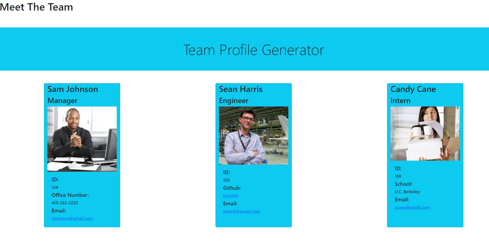

# teamprofilefdh
Creating a webpage that displays all manager's team basic inforamtion. This application is for managers and employees who will have access to their own email and GitHub profiles. 

## Table of Contents

- [Installation](#installation)
- [Usage](#usage)
- [Roadmap](#roadmap)
- [Contributions](#contributions)
- [Questions](#questions)

## Installation

github:

https://github.com/harrisfd/teamprofilefdh

## Usage

When a manager is prompted for their team member's information for the following interns and engineers, then an HTML file is generated displaying a nicely formatted team roster including email address, github username, and manager's phone number, which will open in a new tab. For managers, their information including office number will be displayed, interns will display school, and engineer will display their github name. 

Demonstration Video: https://screencast-o-matic.com/watch/crf3qlVe6oM

## Roadmap

Continuous updates to help improve the overall look of the team profile generator.  

## Contributions

No contributions at this time.

## Questions

Please email fharrisfoster@gmail.com for any questions.